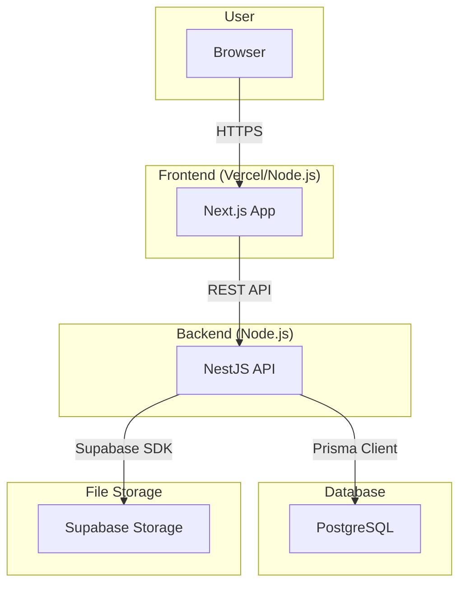

# Media Monorepo Architecture

This document provides an overview of the system architecture, the technology stack chosen, and potential improvements for scaling the system.

## 1. Architecture Diagram

The system is designed as a monorepo containing a frontend web application and a backend API. It leverages cloud services for database and file storage.

### Data Flow:

1.  The user interacts with the **Next.js** frontend in their browser.
2.  The frontend sends API requests (e.g., for uploading or fetching media) to the **NestJS** backend.
3.  The backend uses **Prisma** to communicate with the **PostgreSQL** database for metadata operations (e.g., saving file details).
4.  For file uploads, the backend communicates with **Supabase Storage** to store the actual media files.

## 2. Technology Stack

The choice of technologies is based on modern development practices, scalability, and developer experience.

- **Monorepo:** The project is structured as a monorepo using `pnpm` workspaces. This approach centralizes dependency management and simplifies code sharing between the frontend and backend (e.g., via the `packages/contracts` library).

- **Frontend:**

  - **Next.js:** A React framework that enables server-side rendering and static site generation, providing excellent performance and SEO.
  - **TypeScript:** Adds static typing to JavaScript, which helps in catching errors early and improving code quality.
  - **Tailwind CSS & shadcn/ui:** Used for building a modern and responsive user interface efficiently.

- **Backend:**

  - **NestJS:** A Node.js framework that imposes a modular and organized structure, making the backend scalable and maintainable. It is built with TypeScript.
  - **Prisma:** A next-generation ORM that provides a type-safe database client, simplifying database interactions and reducing runtime errors.

- **Database:**

  - **PostgreSQL:** A powerful and reliable open-source relational database, suitable for a wide range of applications. It is used here via Supabase.

- **Infrastructure:**
  - **Supabase:** Provides the PostgreSQL database and file storage, offering a convenient and scalable backend-as-a-service solution.

## 3. Possible Improvements for Scaling

As the system grows, the following improvements could be considered to handle increased load and complexity.

- **Microservices Architecture:**

  - The backend monolith could be broken down into smaller, independent microservices (e.g., an `auth-service`, a `media-processing-service`). This would allow individual services to be scaled independently.

- **Asynchronous Processing:**

  - For long-running tasks like video transcoding or thumbnail generation, a **message queue** (e.g., RabbitMQ, AWS SQS) could be introduced. This would offload work from the main API, improving its responsiveness.

- **Caching:**

  - Implement a caching layer using a service like **Redis**. This can be used to cache frequent database queries or API responses, significantly reducing database load and improving response times.

- **Content Delivery Network (CDN):**

  - Use a CDN (like Cloudflare or AWS CloudFront) to serve media files and static frontend assets from locations closer to the user. This would drastically reduce latency for users around the world.

- **Database Scaling:**

  - **Read Replicas:** Create read-only copies of the database to handle read-heavy workloads, distributing traffic and reducing the load on the primary database.
  - **Database Sharding:** For extremely large-scale applications, the database could be sharded, partitioning data across multiple database servers.

- **Containerization and Orchestration:**
  - Use **Docker** to containerize the applications and **Kubernetes** to orchestrate them. This simplifies deployment, scaling, and management of the services in a cloud-agnostic way.
